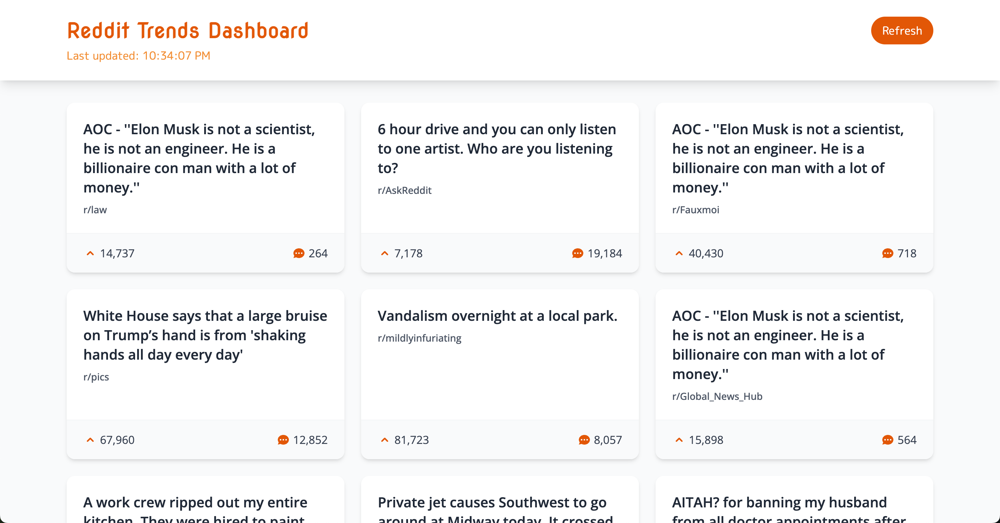

# Mini Trends Dashboard

A simple web application that displays trending topics from Reddit. This project serves as a practice project for building a larger real-time trending searches application.



## Features

- Fetches trending topics from Reddit
- Displays topics in a clean, card-based UI
- Auto-refreshes data periodically
- Allows manual refresh of data

## Tech Stack

### Backend

- Python 3.8+
- FastAPI
- Uvicorn (ASGI server)
- Requests (for API calls)

### Frontend

- React
- Axios (for API calls)
- Bootstrap (for styling)

## Project Structure

```
mini-trends-dashboard/
├── backend/
│   ├── app/
│   │   ├── main.py           # Main FastAPI application
│   │   ├── routers/          # API route definitions
│   │   ├── services/         # Service modules (Reddit API, etc.)
│   │   └── utils/            # Helper functions
│   ├── .env                  # Environment variables (not in git)
│   └── requirements.txt      # Python dependencies
└── frontend/                 # React application
```

## Setup Instructions

### Backend Setup

1. Create and activate a virtual environment:

   ```bash
   python -m venv venv
   source venv/bin/activate  # On Windows: venv\Scripts\activate
   ```

2. Install dependencies:

   ```bash
   pip install -r backend/requirements.txt
   ```

3. Run the backend server:
   ```bash
   cd backend
   python -m app.main
   ```
   The API will be available at http://localhost:8000

### Frontend Setup

1. Install dependencies:

   ```bash
   cd frontend
   npm install
   ```

2. Run the development server:
   ```bash
   npm start
   ```
   The frontend will be available at http://localhost:3000

## API Endpoints

- `GET /api/trends` - Get trending topics
  - Query parameters:
    - `subreddit` (optional): The subreddit to fetch trends from (default: "popular")
    - `limit` (optional): Number of trends to fetch (default: 10)
